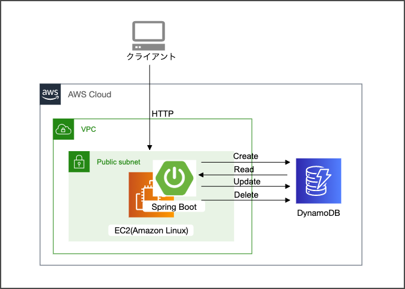

# PoC準備（Spring Boot + DynamoDBについて学習）

## サンプルアプリ概要
 

 

## ライブラリ選定
### ライブラリの候補
- AWS SDK（DynamoDBMapper） ★採用★
- Spring Data DynamoDB

### できることの比較
| 機能         | AWS SDK | Spring Data DynamoDB |
| ---------- | ------- | -------------------- |
| 登録機能       | ●       | ●                    |
| 検索機能（キー検索） | ●       | ●                    |
| 検索機能（値検索）  | ●       | ●                    |
| 並列検索       | ●       | ✗                    |
| トランザクション処理 | ●       | ✗                    |
|      バッチ処理      | ●        |  ✗                    |

 

## DynamoDBMapperのメソッド一覧
| メソッド                       | 機能概要                                                                                       | 機能確認       |
| -------------------------- | ------------------------------------------------------------------------------------------ | ---------- |
| save                       | ・RDBで言うMERGE相当の機能 ・PKが既に登録済の場合はINSERT、未登録の場合はUPDATEを行う                                  | ●          |
| load                       | ・PK検索 ・PKと一致するレコードを返却する                                                                                      | ●          |
| delete                     | ・レコードを削除する ・検索結果に一致する複数レコードを削除したい場合、queryやscanとの組み合わせが必要                                | ●          |
| query                      | ・パーティションキー＋ソートキー検索 ・ソートキーにのみ比較演算子を使用することができる 　("=", "<", "<=", ">", ">=", "BETWEEN") | ●          |
| queryPage                  |・queryの取得結果の先頭1MBのみを取得する                                                                   | ●          |
| scan                       | ・指定した条件で結果セットを絞り込む ・テーブルフルスキャン→絞り込みとなるため、他のオペレーションと比べ、性能がよくない                                                                                           | ●          |
| scanPage                   | ・scanの取得結果の先頭1MBのみを取得する                                                                                           | ●          |
| parallelScan               |・一つのテーブルを複数のセグメントに分割し、それらを並行してscanする                                                                                            | ●          |
| batchSave                  |              ・複数のレコードをまとめてテーブルに登録する ・トランザクション保証はされない                                                                              | ✗(バッチ用途の為) |
| batchLoad                  |             ・PKを使用して、複数のテーブルからレコードを取得する                                                                               | ✗(バッチ用途の為) |
| batchDelete                | ・複数のレコードをまとめてテーブルから削除する ・トランザクション保証はされない                                                                                           | ✗(バッチ用途の為) |
| batchWrite                 |        ・batchLoadとbatchSaveをまとめたメソッド ・複数のレコードをまとめて削除、登録する ・バッチ実行できるのは、最大25件かつデータサイズが1MB以下                                                                                    | ✗(バッチ用途の為) |
| transactionWrite           |  ・複数のレコードをまとめて削除、登録する ・トランザクション制御できるのは、最大25件かつデータサイズが4MB以下 ・トランザクション処理の途中にほかの操作が入った場合、例外をスローする&ロールバックする                                                                                          | ●          |
| transactionLoad            | ・PKに一致するレコードを最大25個のテーブルから取得する ・同一トランザクションのデータを取得することができるので、整合性が取れる ・取得対象のデータが更新中の場合、例外をスローする                                                                                           | ●          |
| count                      | ・指定されたスキャン式の値を求め、一致する項目数を返し、項目データは返されない                                                                                     | ●          |
| generateCreateTableRequest | ・Entityクラスを元に、DynamoDBのテーブルを作成する                                                                                           | ✗(テーブル作成は行わない為)          |
| createS3Link               | ・AmzonS3ストレージへのリンクを作成する ・画像等を保存・参照する際に使用する                                                                                           | ✗(AmazonS3を使用しない為)          |
| getS3ClientCache           |             ・AmazonS3にアクセスするためのオブジェクトを取得する                                                                               | ✗(AmazonS3を使用しない為)          |

 

## 異常系（一部）
- 作成、更新（PKがNull）
 　→　Exception:com.amazonaws.services.dynamodbv2.datamodeling.DynamoDBMappingException: TestMst[id]; null or empty value for primary key
- 検索（0件の場合）
 　→　Nullを返す
- 削除（0件の場合）
 　→　OK

 

## DynamoDBを使用してみての所感
- テーブル設計が難しそう 
→各パーティションに分散するようにパーティションキーを設計する必要がある（ホットパーティションを作らない）
